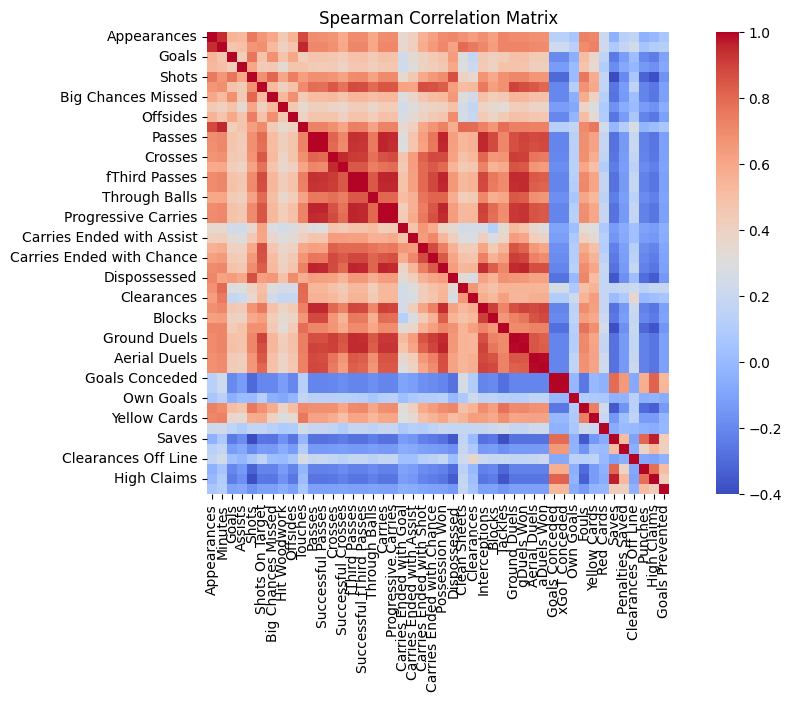

# Premier League Analytics Dashboard 2024-2025 ⚽

## Overview

This project provides a comprehensive analytics platform for the English Premier League 2024-2025 season, offering in-depth analysis of player and team performance through interactive visualizations and statistical insights.



## 🎯 Features

- **Interactive Dashboard**: Built with Streamlit for real-time data exploration

- **Multi-dimensional Analysis**:
  - Player Performance Metrics
  - Team Statistics
  - Position-based Analysis
  - Advanced Performance Indicators

- **Data Visualization**:
  - Interactive Plots
  - Statistical Charts
  - Performance Heat Maps
  - Player Comparison Tools
- **Filtering Capabilities**:
  - By Team
  - By Position
  - By Performance Metrics
  - By Playing Time

## 📊 Data Analysis

### Exploratory Data Analysis (EDA)

- Comprehensive analysis of player statistics
- Performance correlation studies
- Positional play patterns
- Team tactics analysis

Check out our detailed EDA in the `notebooks/eda.ipynb` file.

## 🛠 Technical Stack

- **Python**: Main programming language
- **Libraries**:
  - `streamlit`: Web application framework
  - `pandas`: Data manipulation and analysis
  - `plotly`: Interactive visualizations
  - `seaborn`: Statistical visualizations
  - `numpy`: Numerical computations
  - `scipy`: Statistical analysis

## 📁 Project Structure

```bash

EPL_2024-2025/
├── app/                    # Streamlit application
│   ├── components/        # UI components
│   ├── utils/            # Utility functions
│   ├── main.py           # Main application file
│   └── style.css         # Custom styling
├── data/                  # Data sources
│   └── epl_player_stats_24_25.csv
├── notebooks/             # Jupyter notebooks
│   ├── eda.ipynb         # Exploratory Data Analysis
│   └── prep.ipynb        # Data preparation
├── docs/                  # Documentation
├── img/                   # Images and graphics
└── requirements.txt       # Project dependencies
```

## 🚀 Getting Started

1. **Clone the repository**

```bash
git clone https://github.com/yourusername/EPL_2024-2025.git
cd EPL_2024-2025
```

2. **Set up the environment**

```bash
python -m venv .venv
source .venv/bin/activate  # On Windows: .venv\Scripts\activate
pip install -r requirements.txt
```

3. **Run the application**

```bash
cd app
streamlit run main.py
```

## 📈 Features and Capabilities

### Data Exploration

- Player statistics and performance metrics
- Team performance analysis
- Position-based comparisons
- Advanced statistical analysis

### Interactive Visualizations

- Performance heat maps
- Correlation matrices
- Player comparison radar charts
- Team statistics dashboards

### Analysis Sections

1. **Overview Dashboard**
   - Key performance indicators
   - League-wide statistics
   - Seasonal trends

2. **Player Analysis**
   - Individual performance metrics
   - Comparative analysis
   - Position-specific insights

3. **Team Analysis**
   - Team performance metrics
   - Tactical analysis
   - Squad utilization

4. **Advanced Metrics**
   - Statistical correlations
   - Performance predictions
   - Advanced analytics

## 📝 Data Dictionary

Key metrics included in the analysis:

- **Goals**: Total goals scored
- **Assists**: Goal assists
- **Shots**: Total shots attempted
- **Shot Accuracy**: Percentage of shots on target
- **Passes**: Total passes attempted
- **Pass Accuracy**: Successful passes percentage
- **And many more...**

## 🤝 Contributing

Contributions are welcome! Please feel free to submit a Pull Request.

## 📄 License

This project is licensed under the MIT License - see the LICENSE file for details.

## 👥 Authors

- Your Name (@yourusername)

## 🙏 Acknowledgments

- Premier League for the statistical data
- Contributors and maintainers
- The open-source community

---

⭐ Star this repository if you find it helpful!
